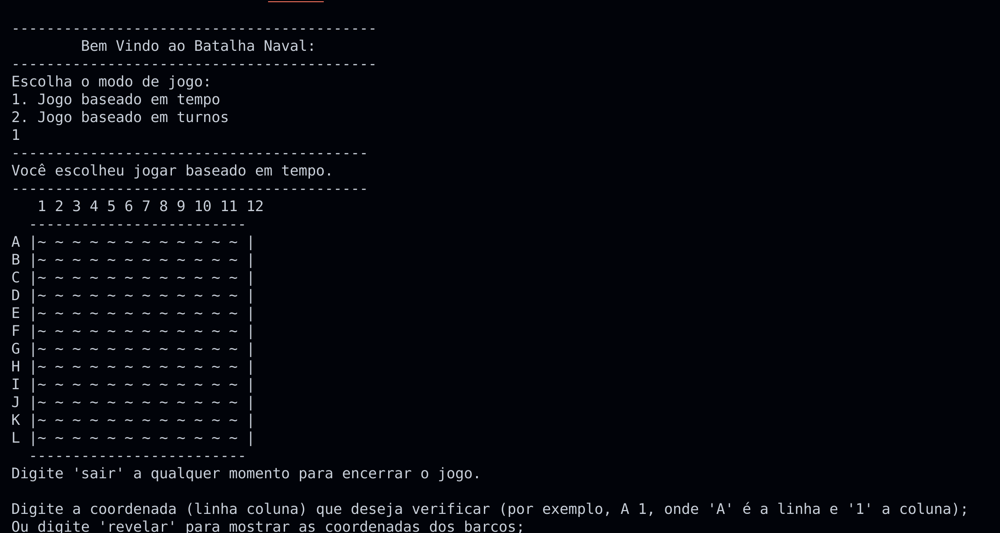
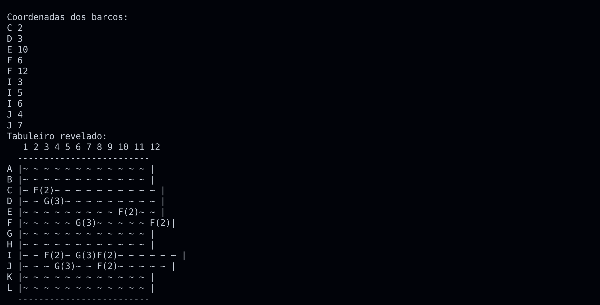

# Warship

**Disciplina**: FGA0210 - PARADIGMAS DE PROGRAMAÇÃO - T01 <br>
**Nro do Grupo (de acordo com a Planilha de Divisão dos Grupos)**: G5<br>
**Paradigma**: Funcional<br>

## Alunos
|Matrícula | Aluno |
| -- | -- |
| 19/0094486  | Pedro Henrique Nogueira |
| 19/0088257  | Guilherme Keyti Cabral Kishimoto|
| 19/0093480  | Matheus Soares Arruda|
| 19/0084642  | Arthur Taylor|
| 19/0088745  | Iago Cabral|
| 19/0042532  | Felipe Alef|
| 20/0042360  | Nicolas Roberto|
| 19/0096071  | Thiago Oliveira|
| 20/2063346  | José Filipi Brito|  
## Sobre 

"Warships" é um jogo de estratégia que oferece aos jogadores duas opções de modo de jogo: turno e tempo. No jogo, os jogadores enfrentam o desafio de acertar três tipos diferentes de barcos - fragata, jangada e galeão - como se fosse um "campo minado inverso". O objetivo principal do jogo é marcar a maior quantidade de pontos possível.<br>
No modo de jogo "turno", os jogadores têm a oportunidade de planejar e pensar estrategicamente antes de realizar seus movimentos, escolhendo com cuidado onde atacar para maximizar seus pontos.<br>
No modo de jogo "tempo", a pressão do tempo entra em cena, desafiando os jogadores a agir rapidamente e tomar decisões ágeis para acertar os barcos e acumular pontos valiosos dentro de um limite de tempo.<br>

## Screenshots



## Instalação 
**Linguagens**: Haskell<br>
**Tecnologias**: GHCI, Prelude<br>
> PS: O prelude tem que estar instalado, e este tutorial é para máquinas linux.
Para rodar o projeto basta clonar o repositório, entrar na pasta do projeto e usar as seguintes linhas no terminal:
<br>
```bash
ghc -o warships warships.hs
```
<br>
E para executar:
<br>

```bash
./warships
```

<br>

## Vídeo
Adicione 1 ou mais vídeos com a execução do projeto.
Procure: 
(i) Introduzir o projeto;
(ii) Mostrar passo a passo o código, explicando-o, e deixando claro o que é de terceiros, e o que é contribuição real da equipe;
(iii) Apresentar particularidades do Paradigma, da Linguagem, e das Tecnologias, e
(iV) Apresentar lições aprendidas, contribuições, pendências, e ideias para trabalhos futuros.
OBS: TODOS DEVEM PARTICIPAR, CONFERINDO PONTOS DE VISTA.
TEMPO: +/- 15min

## Participações
Apresente, brevemente, como cada membro do grupo contribuiu para o projeto.
|Nome do Membro | Contribuição | Significância da Contribuição para o Projeto (Excelente/Boa/Regular/Ruim/Nula) |
| -- | -- | -- |
| Matheus Soares | Eu fiquei responsável pelo ponta-pé inicial do projeto, fazendo funções como a do tabuleiro e criando os tipos de barcos. Também fui responsável por delegar algumas tarefas e prezei pela liberdade criativa do grupo. | Excelente |
| Pedro Henrique Nogueira | Função que coloca os barcos de forma aleatória no tabuleiro e a função que mostra as coordenadas dos barcos no tabuleiro. | Excelente |
| Guilherme Keyti Cabral Kishimoto | Funções para dar dica de barco próximo | Excelente |
| Arthur Taylor | Print para vizualização do mapa quando a função revelar é utilizada. | Excelente |
| Iago Cabral | Funções e lógica de pontuação | Excelente |
| Felipe Alef | Correção de bug de barco infinito. | Excelente |
| Nicolas Roberto | Função que atualiza o mapa | Excelente |
|  Thiago Oliveira |  Seletor de modo de jogo, e modo de jogo por tempo | Excelente |
|  José Filipi Brito | Modo de jogo por turnos | Excelente |
## Outros 
### Dificuldades e resultados
Os integrantes do projeto relataram que enfrentaram desafios para aprender e utilizar a linguagem Haskell, que é diferente das linguagens convencionais e possui um paradigma funcional. Alguns deles disseram que tiveram que recorrer a outras linguagens, como C, para conseguir desenvolver suas ideias. Outros mencionaram que tiveram dificuldade para compreender a estrutura e a lógica do código já existente, e para identificar a funcionalidade adequada para implementar. Apesar dessas dificuldades, todos expressaram satisfação com o resultado final e com a experiência de trabalhar com uma linguagem nova e diferente.

## Fontes
> SOARES, R. Aprenda Haskell: uma introdução prática à programação funcional. São Paulo: Novatec, 2019. 272 p.

